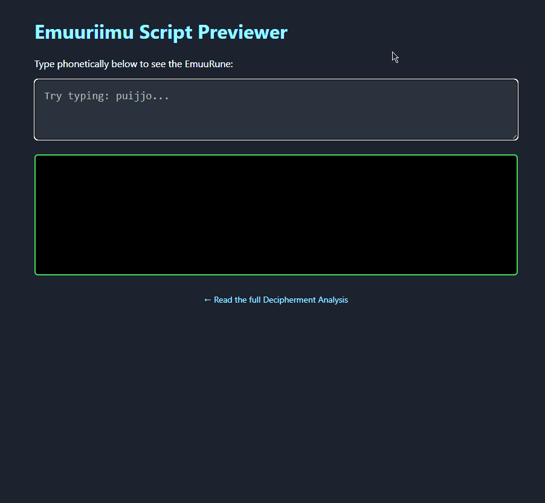

# Emuuriimu: The Savonian Runic Script of EMUUROM

**Status:** Version 0.1 (Alpha)  
**Language:** Phonetic Savonian Finnish (Savo Dialect)  
**Author:** nexiapd  
**License:** [SIL Open Font License (OFL)](https://scripts.sil.org/OFL)

## The Discovery
After a systematic decipherment of the inscriptions in the game *EMUUROM* (developed by Perttu Tuovinen), I have confirmed that the script is not a simple substitution cipher for English. Instead, it is a sophisticated **alphasyllabary** designed to encode the **Savo (Savonian) dialect of Finnish** phonetically.

## Technical Specifications
The font is built on a modular grid system.

- **Syllable Blocks:** Each syllable is a linked unit consisting of an Initial Consonant, a Vowel (or Diphthong), and a Final Consonant.
- **Mirrored Consonants:** Utilizing OpenType `calt` (Contextual Alternates), the font automatically swaps between "Initial" (left-facing) and "Final" (right-facing) consonant shapes based on the neighboring vowels.
- **Ligatures:** Diphthongs and consonant clusters are handled via `liga` features, transforming individual letters into combined, space-efficient glyphs.

## How to Use
1. Download the `Emuuriimu.otf` file from the `/font` folder.
2. Install it on your system.
3. Use an OpenType-compatible software (Microsoft Word, Adobe Suite, SIL FieldWorks, etc.).
4. **Typing:** Type normally in Finnish or Savo. The font's internal logic will automatically assemble the runes into the correct syllable blocks.

## Known Issues (v0.1)
- **Syllable Boundaries:** Detection of syllable breaks in long, vowel-heavy words is still being refined.
- **Complex Clusters:** Clusters involving more than two consonants may not yet render with perfect ligatures.
- **Latin Character Set:** Unused Latin letters (B, C, F, etc.) are left untouched and will render in a basic geometric Latin style.
- **Corpus Limits:** Ligatures currently only account for combinations identified in the current game corpus.

## Contributing
Feedback, bug reports, and pull requests for the `.fea` (OpenType Feature) logic are highly encouraged! If you find a new inscription in-game that this font doesn't handle, please open an Issue.

---
*Disclaimer: This is a fan-made project and is not affiliated with the developer of EMUUROM.*